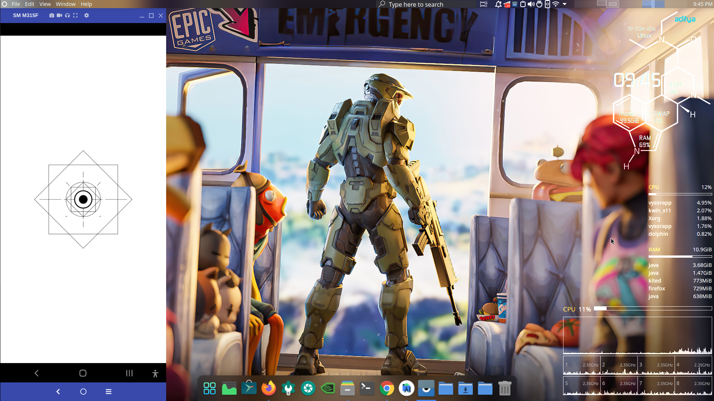
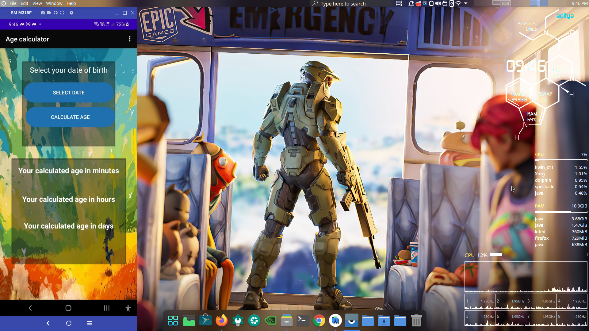
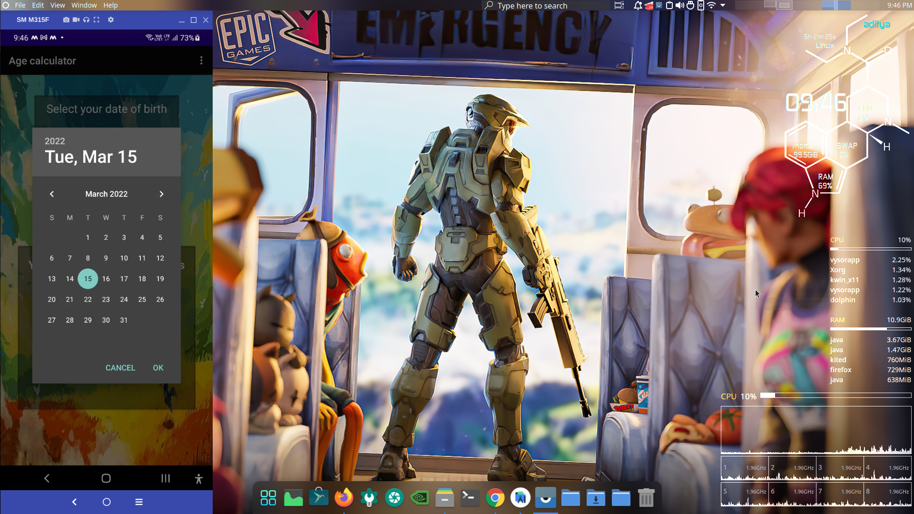
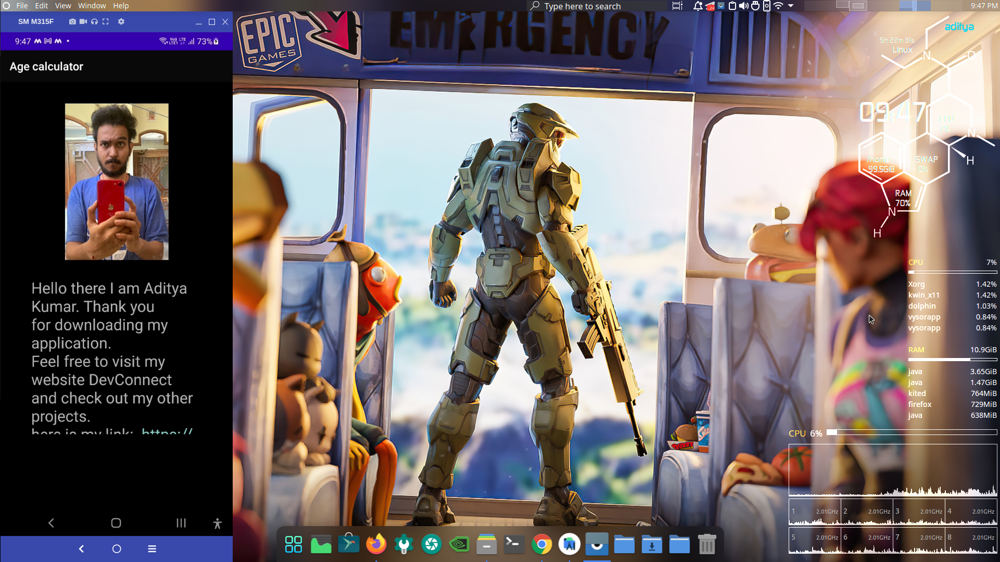

This repo contains The age calculator android application.
This app calcualtes the age in minutes, days , hours and years and displays it to the user after they are done selecting their DOB.
You can Go ahead and download my apk for this application and test this application out just go in the releases section and you can download the apk file from there

here are some sample images :-

